I work in developer relations at Qdrant, which mostly means building things with vector search and then explaining how they work.

Before this I spent a few years on smart contracts and front-end apps, a lot of it helping other developers get unstuck: docs, tutorials, and the kind of troubleshooting where somebody's deploy fails for a reason nobody wrote down. Same job, different stack.

Lately that looks like retrieval benchmarks, HNSW visualizations, and demos that put an index in front of people instead of describing one to them.



Open to read: **[qdrant-hnsw-live](https://github.com/jkupchanko/qdrant-hnsw-live)** &nbsp;·&nbsp; **[qdrant/landing_page](https://github.com/qdrant/landing_page)**



**[LinkedIn](https://www.linkedin.com/in/john-kupchanko/)** &nbsp;·&nbsp; **[YouTube](https://www.youtube.com/@BlockchainBuilders/)**

<details>
<summary>Earlier work and credentials</summary>

<br>

Smart contract and front-end development, mostly 2022 to 2024.

| Institution | Credential |
| --- | --- |
| Metana.io | Advanced Solidity Bootcamp |
| Blockchain Council | Certified Smart Contract Developer |
| Blockchain Council | Certified Solidity Developer |
| knowledgehut upGrad | React.js Developer |
| Udemy | DApp with Solidity and React |
| Codecademy | JavaScript, and Building Interactive JavaScript Websites |

Bachelor of Science, Mechanical Engineering, University of Nevada, Reno.

</details>

<details>
<summary>How these panels are built</summary>

<br>

Every panel in this README is a generated SVG, not a template or a third-party
badge service. `build/hnsw.py` builds an actual three-layer HNSW index and runs
a real greedy descent through it; the node, edge, hop and query figures on the
hero are read off that structure rather than written by hand. `build/live.py`
pulls contribution and language data from the GitHub API, and a scheduled
workflow re-renders the panels when the numbers move.

GitHub renders README images in an `` sandbox, so an SVG there gets no
JavaScript, no network and no web fonts. The typefaces are subset to the 101
glyphs these panels use and inlined as data URIs, and every animation is
declarative CSS. Design tokens live in `build/glasshouse.py`.

```
python build/live.py      # refresh build/data/live.json
python build/render.py    # re-render everything in assets/
```

Renders are byte-deterministic, so re-running with unchanged data produces no diff.

</details>
